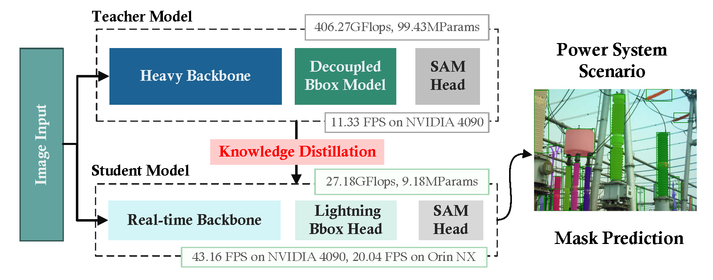
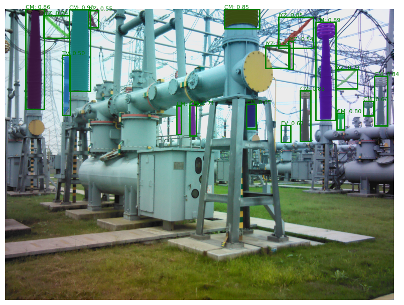
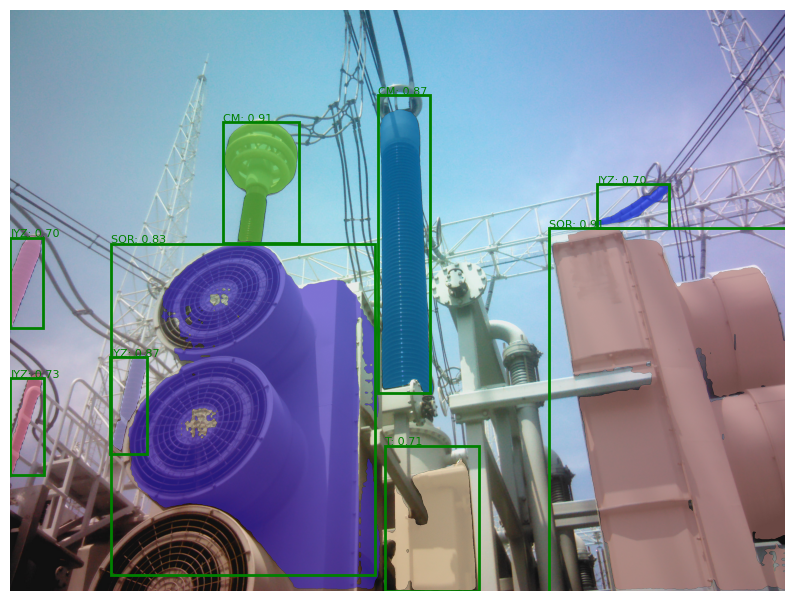

# PowerSAM: Edge-Efficient Segment Anything for Power Systems Through Visual Model Distillation

[ [Paper](https://github.com/fudan-birlab/PowerSAM) ] [ [Project Page](https://fudan-birlab.github.io/PowerSAM/) ]

Authors: Nannan Yan, Yuhao Li, Yingke Mao, Xiao Yu, Wenhao Guan, Jiawei Hou and
Taiping Zeng



**Tl;dr** PowerSAM is proposed as a real-time semantic segmentation framework for edge devices, addressing the challenges of power system equipment inspection, including labor intensity, costs, and human error. By leveraging knowledge distillation from large models to compact backbones and integrating a bounding box prompt generator with a segmentation model, PowerSAM significantly reduces computational complexity while maintaining high segmentation accuracy.

<div style="display: flex; justify-content: space-between;">
  
  
</div>

## Installation

To set up the environment for PowerSAM, follow these steps:

1. Clone the repository:
```sh
git clone https://github.com/fudan-birlab/PowerSAM.git
```

2. Create and activate a new conda environment:
```sh
conda create -n powersam python=3.8 -y
conda activate powersam
```

3. Install PyTorch and related packages:
```sh
pip install torch==2.0.0 torchvision==0.15.1 torchaudio==2.0.1 --index-url https://download.pytorch.org/whl/cu118
# or
conda install -y pytorch==2.0.0 torchvision==0.15.1 torchaudio==2.0.0 pytorch-cuda=11.8 -c pytorch -c nvidia
```

4. Install mmdetection dependencies:
```sh
pip install -U openmim
mim install mmengine==0.10.3
mim install mmcv==2.0.0rc4
mim install mmdet==3.3.0
```

5. Install the required Python packages:
```sh
pip install -r requirements.txt
```

6. Install PowerSAM:
```sh
pip install -e .
```

## Getting Started with PowerSAM

### Demo
To get started with PowerSAM, you can follow the example provided in the [Getting Started with PowerSAM](notebooks/powersam_demo.ipynb). This notebook demonstrates how to use the PowerSAM model for segmentation in power system scenarios.

**Note:** Please download the weights of PowerSAM first and place them in the appropriate directory:
```sh
mkdir weights
wget https://github.com/fudan-birlab/PowerSAM/releases/download/v0.1.0/powersam_b.pth -O weights/powersam_b.pth
wget https://github.com/fudan-birlab/PowerSAM/releases/download/v0.1.0/powersam_s.pth -O weights/powersam_s.pth
wget https://github.com/fudan-birlab/PowerSAM/releases/download/v0.1.0/box_prompt_generator_repvit_epoch_300.pth -O weights/box_prompt_generator_repvit_epoch_300.pth
```

### Inference Example
First, initiating the PowerSAM and bounding box prompt generator respectively:
```sh
from power_sam import sam_model_registry, SamPredictor
from box_prompt_generator.apis import init_box_prompt_generator, inference_box_prompt_generator

device = 'cuda' if torch.cuda.is_available() else 'cpu'
sam = sam_model_registry["power_sam"](checkpoint="weights/powersam_s.pth", arch="m0").to(device=device)
predictor = SamPredictor(sam)

bbox_prompt_generator = init_box_prompt_generator(
    '../box_prompt_generator/configs/box_prompt_generator/self_s_repvit_m0.py',
    '../weights/box_prompt_generator_repvit_epoch_300.pth',
    device=device
)
```

Second, following the steps below to predict mask:
```sh
image = cv2.imread(image_path)
image = cv2.cvtColor(image, cv2.COLOR_BGR2RGB)

result, feats = inference_box_prompt_generator(bbox_prompt_generator, image, return_feats=True)
bbox_prompts = result.pred_instances
bboxes = bbox_prompts.bboxes
bbox_labels = bbox_prompts.labels
bbox_scores = bbox_prompts.scores

predictor.original_size = image.shape[:2]
predictor.input_size = predictor.transform.get_preprocess_shape(image.shape[0], image.shape[1], predictor.transform.target_length)
predictor.is_image_set = True
transformed_boxes = predictor.transform.apply_boxes_torch(bboxes, image.shape[:2])
masks, _, _ = predictor.predict_torch(
    feats[-1] if feats[-1].shape[-2:] == (64, 64)
    else torch.nn.functional.interpolate(feats[-1], (64, 64), mode="bilinear"),
    point_coords=None,
    point_labels=None,
    boxes=transformed_boxes,
    num_multimask_outputs=1,
)
```

## Training

First, the training and validation datasets of SAM should be prepared like [SA-1B Dataset](https://ai.meta.com/datasets/segment-anything/), and the datasets of bounding box prompt generator should be prepared like [MMDetection](https://mmdetection.readthedocs.io/en/latest/user_guides/dataset_prepare.html).

To train the PowerSAM, you should download [teacher model weights](https://dl.fbaipublicfiles.com/segment_anything/sam_vit_b_01ec64.pth), and move it into `weight/` folder.

Distilling backbone, mask decoder and bounding box prompt generator.
```sh
bash training_all_stages.sh
```

## Acknowledgement

We would like to acknowledge the following projects and their contributions to the development of our work:

- **[SAM](https://github.com/facebookresearch/segment-anything)** with [Apache License](https://github.com/facebookresearch/segment-anything/blob/main/LICENSE)
- **[SAM2](https://github.com/facebookresearch/segment-anything)** with [Apache License](https://github.com/facebookresearch/segment-anything/blob/main/LICENSE)
- **[SlimSAM](https://github.com/czg1225/SlimSAM)** with [Apache License](https://github.com/czg1225/SlimSAM/blob/master/LICENSE)
- **[EdgeSAM](https://github.com/chongzhou96/EdgeSAM)** with [S-Lab License 1.0](https://github.com/chongzhou96/EdgeSAM/blob/master/LICENSE)
- **[MMDetection](https://github.com/open-mmlab/mmdetection)** with [Apache License](https://github.com/open-mmlab/mmdetection/blob/main/LICENSE)
- **[YOLOX](https://github.com/Megvii-BaseDetection/YOLOX)** with [Apache License](https://github.com/Megvii-BaseDetection/YOLOX/blob/main/LICENSE)
