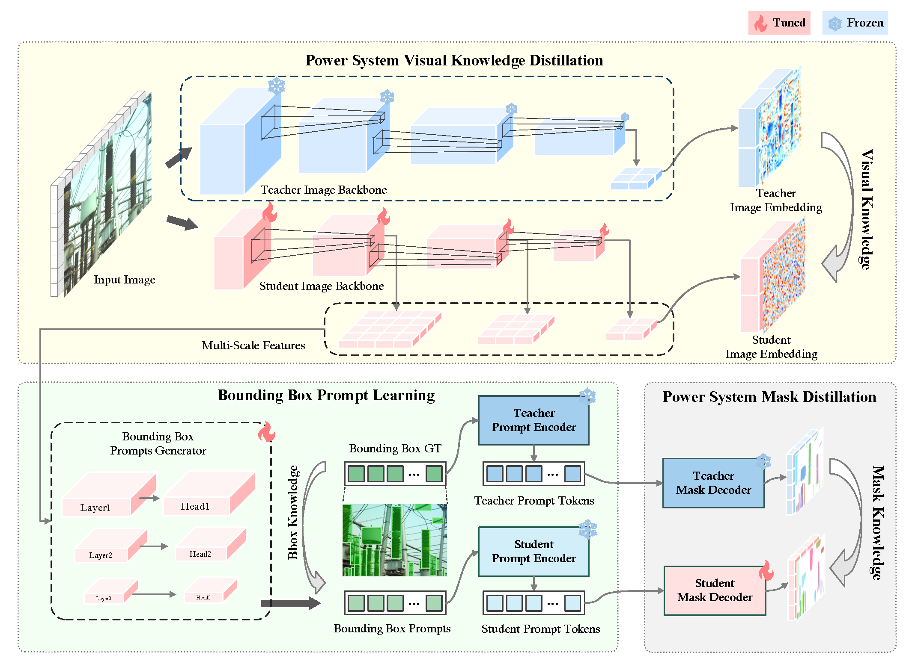

# PowerSAM: Edge-Efficient Segment Anything for Power Systems Through Visual Model Distillation

[ [Paper](https://github.com/fudan-birlab/PowerSAM) ] [ [Project Page](https://github.com/fudan-birlab/PowerSAM) ]

Authors: Nannan Yan, Yuhao Li, Yingke Mao, Xiao Yu, Wenhao Guan, Jiawei Hou and
Taiping Zeng

**Tl;dr** PowerSAM is proposed as a real-time semantic segmentation framework for edge devices, addressing the challenges of power system equipment inspection, including labor intensity, costs, and human error. By leveraging knowledge distillation from large models to compact backbones and integrating a bounding box prompt generator with a segmentation model, PowerSAM significantly reduces computational complexity while maintaining high segmentation accuracy.

<!-- ## Installation -->

## Getting Started
The code will be available soon.

<!-- ## Acknowledgement -->
